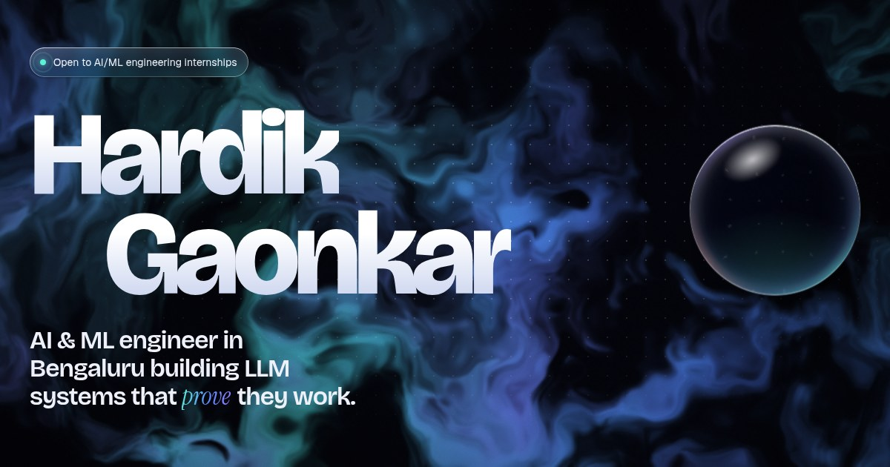

# Hardik Gaonkar · Portfolio

Personal portfolio for Hardik Santosh Gaonkar, AI & ML engineer in Bengaluru.

It's a static site with no build step and no dependencies: plain HTML, CSS and JavaScript, plus a WebGL shader for the background.



## What's in it

- **Liquid glass UI.** Frosted glass panels with specular rim light and a cursor spotlight. In Chromium browsers (Chrome, Edge, Arc, Brave), the nav, buttons and hero lens also *refract* what sits behind them. A displacement map is generated for each element's shape and applied as an SVG `backdrop-filter`. Safari and Firefox get the frosted version.
- **Flowing background.** A domain-warped noise field in WebGL. It drifts as you scroll and moves out of the way of the cursor. It renders at reduced resolution, is capped at 30fps and pauses in background tabs.
- **Draggable lens** in the hero that magnifies the name as it passes over it.
- **Live diagrams** for each project: CareFlow AI's access-controlled request path, PatchPilot's agent and repair loop, and GroundTruth's sentence verification.
- **Accessible by default.** Semantic landmarks, a skip link and visible focus states. `prefers-reduced-motion` turns off animation, and all content is visible without JavaScript.

## Structure

```
index.html                  page content
assets/css/style.css        design tokens, glass system, layout
assets/js/aurora.js         WebGL background
assets/js/liquid-glass.js   refraction filters for [data-liquid] elements
assets/js/main.js           nav, reveals, counters, terminal, lens, diagrams
assets/img/                 favicon and social preview image
assets/Hardik_Gaonkar_Resume.pdf
```

## Run locally

Any static server works:

```bash
npx serve .
# or
python3 -m http.server 8000
```

## Deploy on GitHub Pages

1. Go to **Settings → Pages** in this repository.
2. Under **Build and deployment**, choose **Deploy from a branch**. Select the branch and the `/ (root)` folder.
3. The site will be live at `https://hrdk6.github.io/MyPortfolio/`.

The `og:image` URL in `index.html` assumes that address. Update it if you use a custom domain.

## Editing content

All text is in `index.html`. Colours, fonts and radii are CSS custom properties at the top of `assets/css/style.css`. To make any element refract, add `data-liquid`. Its tuning attributes are documented at the top of `assets/js/liquid-glass.js`.
